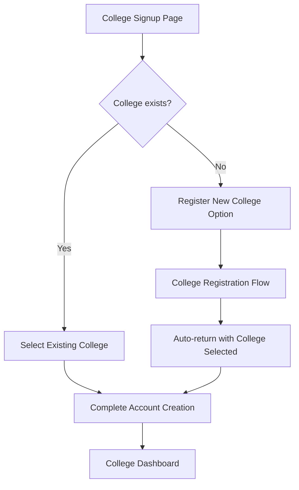

# Design Document

## Overview

This design addresses the college account creation flow issue by implementing a seamless integration between college registration and account creation. The solution provides two clear paths: selecting an existing college or registering a new one, with proper state management to ensure a smooth user experience.

## Architecture

### Flow Architecture



### State Management

The solution uses a combination of:
- **Session Storage**: For preserving form data during navigation
- **URL Parameters**: For passing college registration results
- **React State**: For managing UI state and form validation

## Components and Interfaces

### Modified College Signup Page

**File**: `src/app/auth/signup/college/page.tsx`

**Key Changes**:
1. Add "Register New College" option below the college dropdown
2. Implement session storage for form data persistence
3. Handle return flow from college registration
4. Add college search/filter functionality

**New UI Elements**:
- "Can't find your college?" link
- "Register New College" button
- Loading states for college search
- Success message for returning users

### College Registration Integration

**File**: `src/components/CollegeRegistrationForm.tsx`

**Key Changes**:
1. Add support for redirect parameters
2. Implement callback handling for signup flow
3. Add minimal registration mode for signup context

### Session Management Service

**New File**: `src/lib/services/signup-session.ts`

**Purpose**: Manage form data persistence during the college registration detour

**Interface**:
```typescript
interface SignupSession {
  formData: CollegeSignupFormData
  timestamp: number
  step: 'college-selection' | 'college-registration' | 'account-creation'
}

class SignupSessionManager {
  saveFormData(data: CollegeSignupFormData): void
  getFormData(): CollegeSignupFormData | null
  clearSession(): void
  setStep(step: string): void
  getStep(): string | null
}
```

## Data Models

### Enhanced College Signup Form Data

```typescript
interface CollegeSignupFormData {
  // Personal Information
  firstName: string
  lastName: string
  email: string
  password: string
  confirmPassword: string
  phone: string
  
  // College Association
  collegeId: string
  collegeName?: string // For newly registered colleges
  
  // Role Information
  contactPerson: string
  designation: string
  
  // Flow Management
  isNewCollege?: boolean
  registrationSource?: 'existing' | 'new'
}
```

### College Registration Context

```typescript
interface CollegeRegistrationContext {
  source: 'direct' | 'signup-flow'
  redirectTo?: string
  userData?: Partial<CollegeSignupFormData>
}
```

## Error Handling

### Error Scenarios

1. **College Not Found**: Clear messaging with registration option
2. **Session Timeout**: Graceful fallback with form reset option
3. **Registration Failure**: Return to signup with error context
4. **Duplicate College**: Handle existing college detection

### Error Recovery

- **Auto-save**: Form data saved on every input change
- **Session Recovery**: Detect and restore interrupted sessions
- **Validation Feedback**: Real-time validation with clear messages
- **Fallback Options**: Always provide alternative paths

## Testing Strategy

### Unit Tests

1. **Session Management**:
   - Form data persistence
   - Session timeout handling
   - Data serialization/deserialization

2. **Form Validation**:
   - College selection validation
   - Password strength validation
   - Email format validation

3. **Flow Navigation**:
   - Redirect parameter handling
   - State preservation
   - Error boundary testing

### Integration Tests

1. **Complete Flow Testing**:
   - Existing college selection flow
   - New college registration flow
   - Error recovery scenarios

2. **Cross-Component Communication**:
   - College registration callback
   - Session data transfer
   - URL parameter handling

### User Experience Tests

1. **Flow Continuity**:
   - No data loss during navigation
   - Consistent UI states
   - Clear progress indicators

2. **Error Scenarios**:
   - Network failure recovery
   - Invalid data handling
   - Session expiration

## Implementation Phases

### Phase 1: Session Management
- Implement session storage service
- Add form data persistence
- Create session recovery logic

### Phase 2: UI Enhancement
- Add "Register New College" option
- Implement college search functionality
- Add loading and error states

### Phase 3: Flow Integration
- Connect college registration callback
- Implement redirect handling
- Add success/error messaging

### Phase 4: Testing & Polish
- Comprehensive testing
- Performance optimization
- Accessibility improvements

## Security Considerations

### Data Protection
- **Session Storage**: Use secure session storage with expiration
- **Form Data**: Sanitize all user inputs
- **Password Handling**: Never store passwords in session

### Validation
- **Server-side Validation**: All form data validated on backend
- **CSRF Protection**: Implement CSRF tokens for form submissions
- **Rate Limiting**: Prevent abuse of registration endpoints

## Performance Considerations

### Optimization Strategies
- **Lazy Loading**: Load college list on demand
- **Debounced Search**: Implement search debouncing
- **Caching**: Cache college list with appropriate TTL
- **Bundle Splitting**: Separate college registration code

### Monitoring
- **Session Analytics**: Track completion rates
- **Error Tracking**: Monitor registration failures
- **Performance Metrics**: Measure form completion times